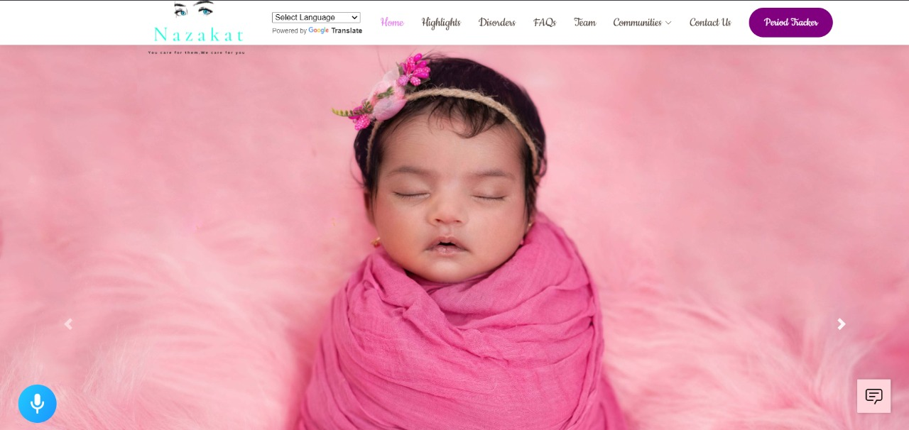

# Nazakat
## You care for them, We care for you.

## Our Vision

A woman is a full circle, within her is the power to create,nurture and transform. 

Having said that, it is very common to see them care a river for others and not spend even a drop of it on themselves. The kind of ignorance we see in women regarding their health is absolutely frightening as the ignorance continues until the very end in most cases. 

In India, especially rural women, have numerous reasons as to why seeing a doctor is the last thing on their minds.These reasons include the stigma around talking about women's health, for example menstrual hygiene, unawareness, the huge medical costs and unavailability of resources.

Well, what is there to which technology can’t offer a solution?
We have come up with an amalgamation of services dedicated to women health in the form of our website- NAZAKAT, an urdu word for delicate. 
Our vision is to unite women together and give them a safe, cosy place to learn, discuss, make friends and heal themselves. 

As we all know, even in today’s technology-driven world, women are uncomfortable using it.So, our website has a very simple, yet appealing UI with all the assistant you will need kept at one single place

 ## Tech Stack
 1. Python
 2. PyTorch
 3. Flask
 4. HTML
 5. CSS
 6. JavaScript
 7. Socket
 8. Node

## Website Overview
<h2 align= "left"><b>Let's Have a Look at Website 🔥</b></h2>

## Home Page  
 &ensp;  
 &ensp;  
 &ensp; 
 &ensp;
 &ensp; 
 &ensp;  
 &ensp;  
 &ensp;  
 &ensp;  
 
 
## Baby Tracker 
 &ensp;
 &ensp;  

## Period Tracker  
 &ensp;  

## SheBot  
 &ensp; 
 &ensp;  

## Alan API 
 &ensp;  

 ## Cancer Diagnosis
 &ensp;  
 
PPT- https://drive.google.com/file/d/1zu5j2umCujyg-_0dtEUZETZxKPNnsERE/view?usp=sharing
 
## How to Run

run:
python main.py
 
Click on the server link. 
